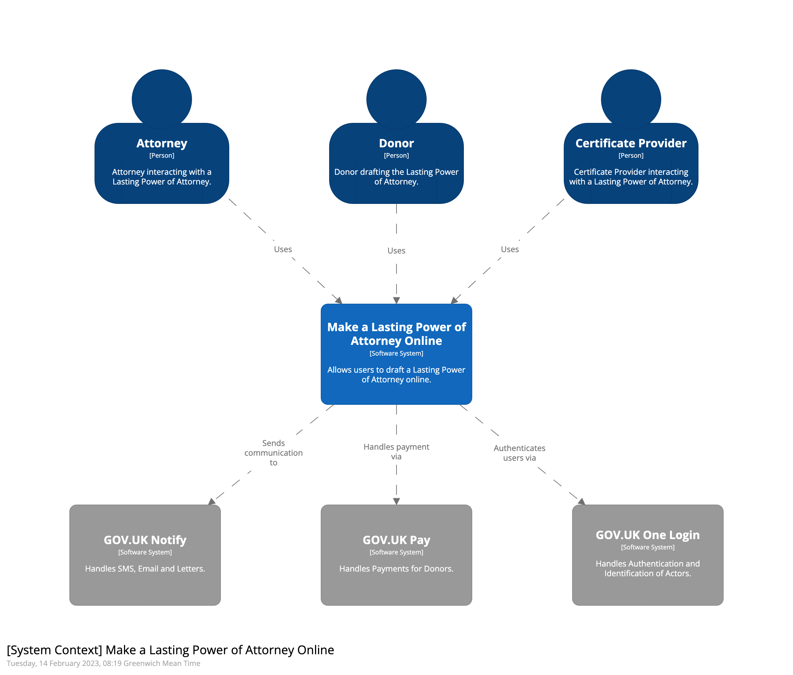

# C4 Models via Structurizer

## Purpose

To provide an up to date Diagram as Code C4 Model of our application model to maintain a overview of the structure.

This should be updated as changes to the application occur and can be used to plan future iterations of the application structure.

## Instructions

- Run `make create-c4model`
- Open a browser to [http://localhost:8080](http://localhost:8080)
- Open the workspace.dsl file and edit
- Every 2 seconds the website will check for updates and refresh if changes are detected
- Export any changes as images into this directory before committing

## Diagrams

### Level 1 - System Context

### Level 2 - Container Context

#### Make a Lasting Power of Attorney Online

