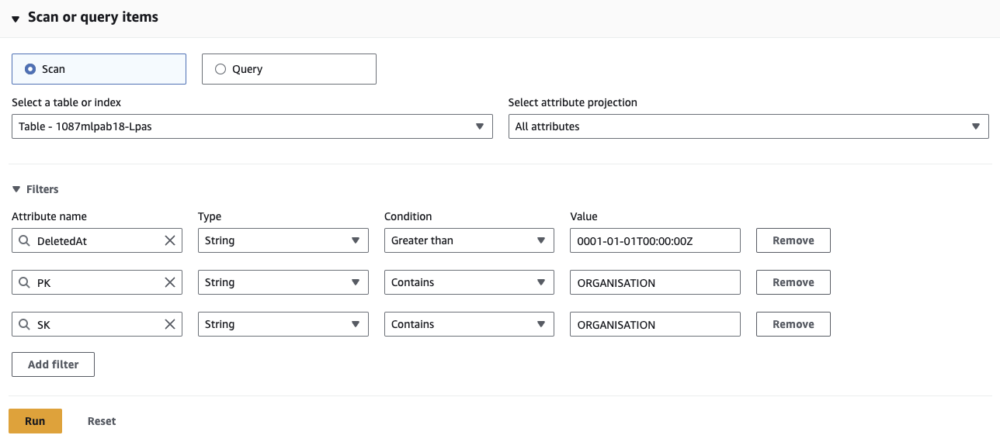
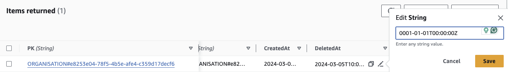

# Recovering a deleted organisation

## Overview
Organisation admins have the option of deleting an organisation they are a member of. In reality this action adds a `DeletedAt` date to the organisation rather than removing the data so we have the ability to restore an organisation if it has been deleted in error.

## Steps
- Log in to AWS console under the relevant account
- Go to [DynamoDB explore items](https://eu-west-1.console.aws.amazon.com/dynamodbv2/home?region=eu-west-1#item-explorer) and choose the `lpas` table
- Open the filters details component and filter by:
  - `DeletedAt` `String` `Greater than` `0001-01-01T00:00:00Z`
  - `PK` `String` `Contains` `ORGANISATION`
  - `SK` `String` `Contains` `ORGANISATION`
    - 

      
Example values

      
    

- If you know the name of the organisation then this can be added to the filter, or alternatively, filter on the values above and find it in the list of results
- Edit `DeletedAt` to `0001-01-01T00:00:00Z` and save the change
  - 

      
Example edit view

    
    

The organisation should now be restored and any members in the organisation will be able to log in again.
